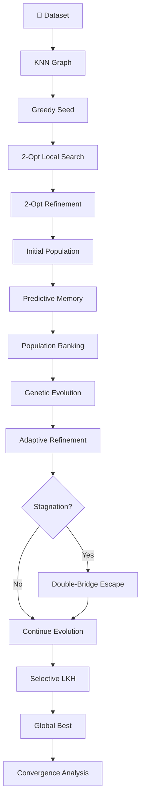

# 🧬 Adaptive Evolution Study Editor

<p align="center">
  
  
  
  
</p>

<p align="center">
  <b>Interactive Evolution Study Dashboard for Adaptive Genetic Optimization</b>
</p>

---

## 🖥️ Application Interface

The project provides a browser-based dashboard for studying and visualizing the evolution of solutions generated by the Adaptive Genetic Algorithm.

The interface brings together dataset management, algorithm execution, route visualization, population analysis, convergence tracking, and adaptive-search metrics in a single environment.

---

## ✨ Main Features

### 📂 Dataset Upload

The application supports:

* `.tsp` TSPLIB datasets
* Coordinate `.csv` datasets

The uploaded dataset is processed and converted into the required distance representation for optimization.

### 🗺️ Route Visualization

The dashboard displays the current best TSP route graphically, allowing the progression of solution quality to be observed visually.

### 📊 Population Analysis

The application provides information about the current population, including:

* Individual ranking
* Tour cost
* Fitness
* Generation
* Optimization method

### 📈 Convergence Analysis

A convergence graph tracks the best solution discovered during the evolutionary process across generations.

### 🧬 Adaptive Evolution Analysis

The dashboard provides visibility into:

* Adaptive operator activity
* Population diversity
* Predictive-memory trust
* Improvement across generations
* Stagnation behavior
* Selective local optimization

### 📋 Execution Monitoring

The system records the latest algorithmic state and important statistics so that the evolution process can be studied rather than treated as a black-box optimization.

---

## 🧬 Algorithm Workflow



---

## 📈 Visualization

The application is designed to visualize different aspects of the evolutionary process:

```text
Solution Quality
       ↓
Population Evolution
       ↓
Adaptive Operator Behavior
       ↓
Diversity / Stagnation
       ↓
Local Optimization
       ↓
Final Convergence
```

---

## 🖼️ Screenshots

Screenshots of the application can be placed in the repository:

```markdown

```

```markdown

```

```markdown

```

```markdown

```

---

## 🚀 Running the Application

### 1. Extract the ZIP

Extract:

```text
adaptive_evolution_study_editor.zip
```

### 2. Open the project

Open the extracted folder in VS Code.

### 3. Open the terminal

In VS Code:

```text
Terminal → New Terminal
```

### 4. Start the application

On Windows:

```powershell
.\run_windows.bat
```

On macOS/Linux:

```bash
./run_mac_linux.sh
```

### 5. Open the application

After the server starts, open:

```text
http://127.0.0.1:8000
```

The Adaptive Evolution Study Editor will open in the browser.

---

## 🎯 Purpose

The Adaptive Evolution Study Editor is intended to provide an interactive environment for analyzing the behavior of an adaptive genetic optimization process.

Rather than focusing only on the final solution, the application makes it possible to study:

* Initial solution generation
* Local-search improvement
* Population evolution
* Adaptive optimization
* Diversity and stagnation
* Diversification mechanisms
* Selective local optimization
* Final convergence

---

## ⚠️ Note

The supplied algorithm notebook does not contain a separate implementation named **Qubic Ranking**. The application therefore represents the actual population-ranking behavior present in the source algorithm rather than introducing an unsupported algorithmic component.

---

<p align="center">

### 🧬 Adaptive Evolution Study Editor

<b>Visualize • Analyze • Experiment • Study</b>

</p>
